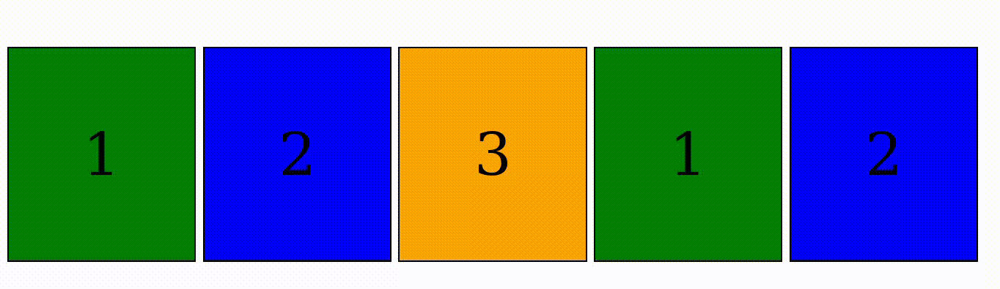
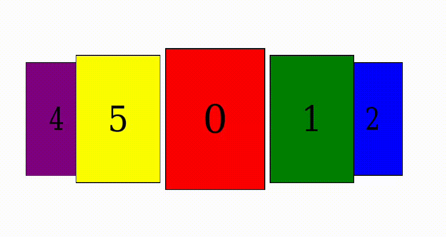

# React Carouzef - A Flexible and Interactive Carousel Component



If you kwnow CSS and don't want or **need** to go through the hassle of setting up Swiper.js.

## Features

- 🔄 **Smart Looping**: Seamless infinite scrolling with automatic item duplication
- ⚡️ **Auto-Play**: Configurable rotation with custom intervals and step sizes
- 👆 **Intuitive Controls**: Swipe gestures, click navigation, and direct item selection
- 🧩 **CSS Customization**: Write your own carousel animations and import them in your components.
- 🚫 **Ignorable Children**: Special class to exclude elements from carousel flow
- ⚛️ **React Hooks API**: `useCarouzef` and `useCarouzefItem` for advanced customization
- 📱 **Responsive Design**: Adapts to different screen sizes and item counts
- 🧪 **TypeScript Support**: Fully typed components and hooks

## Installation

```bash
npm install react-carouzef
# or
yarn add react-carouzef
```

## Usage

### Basic Implementation

```jsx
import { Carouzef } from "react-carouzef";
import "react-carouzef/base";
import "react-carouzef/css/sphere"; // Import some css animation
/* // or use your own
import "./myCustomAnimation.css"*/

function MyCarousel() {
  return (
    <div className="carousel">
      <Carouzef itemsPerView={3} autoPlay={true}>
        <div style={{ ...divStyle, backgroundColor: "red" }}>0</div>
        <div style={{ ...divStyle, backgroundColor: "green" }}>1</div>
        <div style={{ ...divStyle, backgroundColor: "blue" }}>2</div>
        <div style={{ ...divStyle, backgroundColor: "orange" }}>3</div>
        <div style={{ ...divStyle, backgroundColor: "purple" }}>4</div>
        <div style={{ ...divStyle, backgroundColor: "yellow" }}>5</div>
      </Carouzef>
    </div>
  );
}
```



## Props

| Prop Name               | Type                                 | Default                                         | Description                                                                                                                                                 |
| ----------------------- | ------------------------------------ | ----------------------------------------------- | ----------------------------------------------------------------------------------------------------------------------------------------------------------- |
| `itemsPerView`          | `number`                             | `2`                                             | Number of items visible simultaneously                                                                                                                      |
| `startingItem`          | `number`                             | `0`                                             | Initial active item index (0-based)                                                                                                                         |
| `loop`                  | `boolean`                            | `true`                                          | Enable infinite looping mode                                                                                                                                |
| `autoPlay`              | `number` \| `object` \| `true`       | `undefined`                                     | Auto-rotation configuration                                                                                                                                 |
| `cssStyle`              | `Record<string, string>`             | `{}`                                            | Custom CSS variables/styling for container and items                                                                                                        |
| `changeItemOnClick`     | `boolean`                            | `true`                                          | Enable item selection when clicked                                                                                                                          |
| `swipeThreshold`        | `number`                             | `50`                                            | Minimum swipe distance (pixels) to trigger navigation                                                                                                       |
| `axis`                  | `"horizontal"` \| `"vertical"`       | `"horizontal"`                                  | Carousel and and swipe orientation (you should handle transformation in you css accordingly)                                                                |
| `keyboardNavigation`    | `Record<string, "next"\|"previous">` | `{ ArrowLeft: "previous", ArrowRight: "next" }` | Keyboard mapping for navigation ([key reference](https://developer.mozilla.org/en-US/docs/Web/API/UI_Events/Keyboard_event_key_values#numeric_keypad_keys)) |
| `keyboardEventThrottle` | `number`                             | `500`                                           | Minimum time (ms) between keyboard events to prevent rapid navigation                                                                                       |

### AutoPlay Configuration

Configure automatic rotation using:

- **Number**: Interval duration in milliseconds (`3000`)
- **Object**:
  ```ts
  {
    interval: number,  // Rotation interval (ms)
    step?: number       // Items to advance per rotation (default: 1)
  }Minimum swipe distance to trigger navigation |
  ```

### AutoPlay Configuration

When using the `autoPlay` prop:

- **Number**: Interval in milliseconds (e.g., `3000`)
- **Object**:
  ```ts
  {
    interval: number, // Required
    step?: number     // Optional (default: 1)
  }
  ```
- **Boolean**: `true` uses default interval of 3000ms

## Hooks

### `useCarouzef()`

Provides access to carousel state and navigation methods:

```ts
interface CarouzefContext {
  index: number; // Current active index
  numberOfItems: number; // Total items (including duplicates)
  realNumberOfItems: number; // Original item count
  itemsPerView: number; // Visible items
  loop: boolean; // Looping enabled
  incrementIndex: (n: number) => void; // Navigate by n items
  setIndex: (n: number) => void; // Set specific index
}
```

### `useCarouzefItem()`

Provides context for individual carousel items:

```ts
interface ItemContext {
  index: number; // Item index
  activeIndex: number; // Current active index
  toActiveIndex: number; // Relative position to active item
  position: ItemPosition; // Position classification
}

enum ItemPosition {
  HIDDEN = "hidden",
  PREV = "prev",
  NEXT = "next",
  AFTER = "after",
  BEFORE = "before",
  ACTIVE = "active",
}
```

## Styling Options

### CSS Variable Customization

The `cssStyle` prop allows you to override any CSS variable value for the main container. This enables dynamic, responsive animations that can adapt to different screen sizes or user interactions.

You can also pass `cssStyle` directly to individual carousel items. The component will automatically apply these styles to their respective containers:

```jsx
const [scale, setScale] = useState(0.8);
const [spin, setSpin] = useState(0);

return (
  <Carouzef
    cssStyle={{
      "--scale": `${scale}`,
      "--perspective": "1200px",
    }}
  >
    <div cssStyle={{ "--spin": `${spin}deg` }}>Interactive Item 1</div>
    <div cssStyle={{ "--spin": `${spin + 15}deg` }}>Interactive Item 2</div>
  </Carouzef>
);
```

## Creating Custom Animations

You can build unique animations by leveraging the CSS variables and position classes. The carousel provides these key variables:

- `--distance-to-active `: Relative position to active item (negative = left, positive = right)

- `--item-index`: Absolute item index

- `--items-per-view`: Number of visible items

Combine these with the procided classes to create advanced effects:

- `carousel-container` : The main container
- `carousel-item` : Common class for all items
- `carousel-container` : The main container
- `carousel-item` : Common class for all items
- `carousel-item-next` / `carousel-item-prev` : Classes for items imediatly before and after the active item.
- `carousel-item-after` / `carousel-item-before` : Classes for other items before and after the active item.
- `carousel-item-hidden` : Class for hidden item.

Look at the provided css style for example on how to set up you own animation.

## Reserved CSS variable

The Component rely on some default CSS that's internally loaded. You shouldn't overide anything defined in this file.

```css
.carousel-container {
  --items-per-view: 3; /*default value*/
  position: relative;
  overflow-x: hidden;
  overflow-y: clip;
}

.carousel-item {
  --distance-to-active: 0; /*default value*/
  --item-index: 0; /*default value*/
  position: absolute;
  top: 50%;
  left: 50%;
  translate: -50% -50%;
  --width: calc(100% / var(--items-per-view));
  --height: calc(100% / var(--items-per-view));
  width: var(--width);
  height: var(--height);
}
```

## Ignoring Items

Add items that shouldn't be part of the carousel flow by including the `carousel-ignore` class:

```jsx
<Carouzef itemsPerView={3}>
  <div>Carousel Item 1</div>
  <div className="carousel-ignore">Non-Carousel Content</div>
  <div>Carousel Item 2</div>
</Carouzef>
```

## License

Free to use copy, modify, distribute... I don't care, just use it if you need it.
